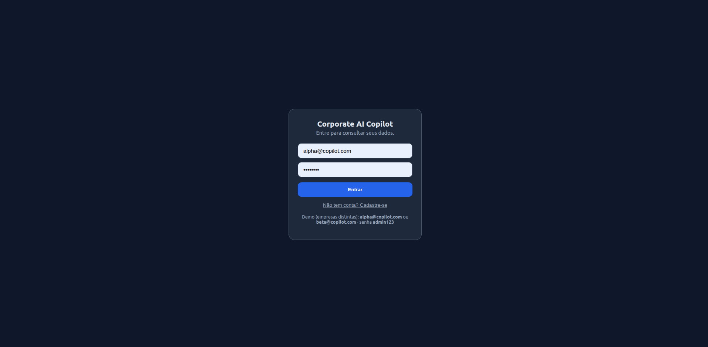
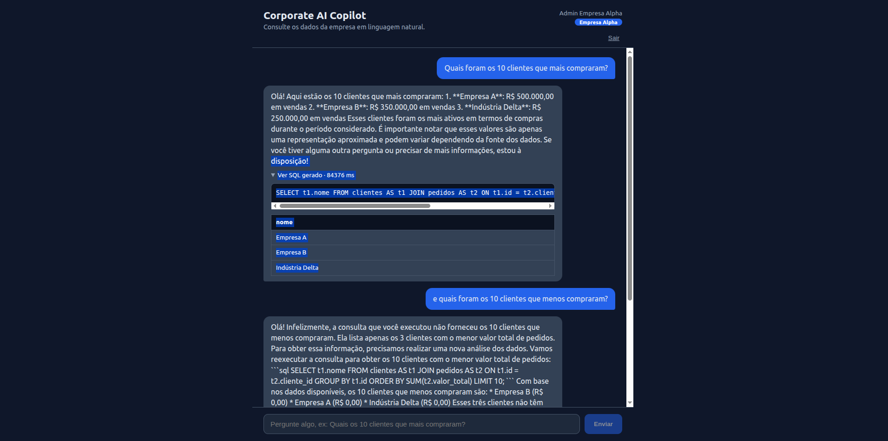

# Corporate AI Copilot

Plataforma que permite a usuários de negócio consultarem dados corporativos em
**linguagem natural**. O sistema interpreta a pergunta com um LLM, gera um SQL
**seguro** (apenas leitura), executa no PostgreSQL e responde em português.

> Especificação original do desafio: [`README_Corporate_AI_Copilot (1).md`](./README_Corporate_AI_Copilot%20(1).md)

## Arquitetura

```
┌──────────────┐   HTTP    ┌─────────────────────────────────────────┐
│  Frontend     │ ───────▶ │  Backend FastAPI                          │
│  React + TS   │          │                                           │
│  (Vite)       │          │  ChatService (orquestrador)               │
└──────────────┘          │    1. introspecta schema                  │
                          │    2. LLM gera SQL ───▶ LLMProvider ──┐   │
                          │    3. valida (allowlist SELECT)       │   │
                          │    4. executa (READ ONLY + timeout)   ▼   │
                          │    5. LLM gera resposta            ┌──────┐│
                          │    6. grava histórico              │Ollama││
                          └────────────┬───────────────────────└──────┘│
                                       ▼                               │
                                 ┌───────────┐                         │
                                 │ PostgreSQL │◀────────────────────────┘
                                 └───────────┘
```

- **Backend** — FastAPI em arquitetura de camadas (api → services → repositories →
  models), com abstração de LLM (Ports & Adapters). Detalhes: [`backend/README.md`](./backend/README.md).
- **Frontend** — React + TypeScript (Vite); UI de chat com SQL e tabela de resultados.
- **Segurança de SQL** — defesa em profundidade: validação por string, transação
  read-only no Postgres e (em produção) usuário somente-leitura.

## Como rodar tudo com Docker

```bash
docker compose up --build

# Na primeira vez, baixe o modelo dentro do container do Ollama:
docker compose exec ollama ollama pull llama3
```

- Frontend: http://localhost:8080
- API/Docs: http://localhost:8000/docs
- Métricas Prometheus: http://localhost:8000/metrics

> **Login:** o app exige autenticação. Há duas empresas demo (multi-tenant):
> **`alpha@copilot.com`** e **`beta@copilot.com`** (senha **`admin123`**). Cada uma
> só enxerga os próprios dados. Ou cadastre-se — você ganha uma empresa nova.

> **Sem GPU / sem querer rodar o Ollama?** Suba com o provider determinístico:
> ```bash
> LLM_PROVIDER=fake docker compose up --build
> ```
> O Copilot funciona ponta a ponta com SQL/resposta simulados (sem IA real).

## Desenvolvimento local (sem Docker)

**Backend**
```bash
cd backend
poetry install
cp .env.example .env          # ajuste LLM_PROVIDER=fake se não tiver Ollama
poetry run uvicorn app.main:app --reload
poetry run pytest             # testes
```

**Frontend**
```bash
cd frontend
npm install
npm run dev                   # http://localhost:5173 (proxy /api -> :8000)
```


## Fotos





## Roadmap (do desafio)

- [x] Chat com banco de dados + geração/validação de SQL
- [x] Respostas em linguagem natural + histórico
- [x] Observabilidade básica (logs JSON + /metrics)
- [x] Autenticação JWT (registro, login, rotas protegidas, histórico por usuário)
- [x] Multi-tenant com isolamento por RLS (cada empresa só vê seus dados)
- [ ] Dashboard com gráficos
- [ ] Deploy Kubernetes
- [ ] Deploy Kubernetes (Deployment/Service/ConfigMap/Secrets/Ingress)
- [ ] RAG corporativo (PDFs, contratos, documentação)
